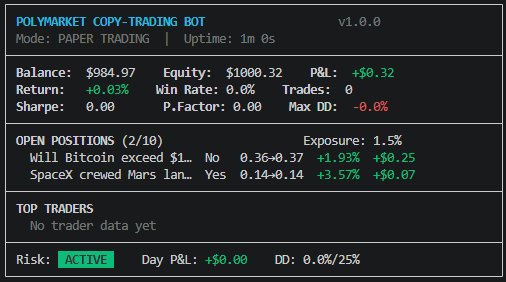
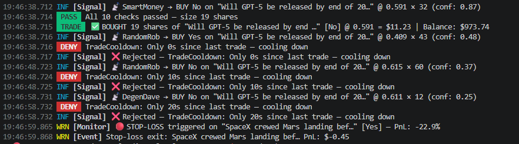
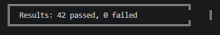

# Polymarket Copy-Trading Bot

Copy-trading bot for [Polymarket](https://polymarket.com) prediction markets. Tracks target wallets, replicates their trades through a 10-layer risk pipeline, scores trader performance. Ships with paper trading mode and mock signal generator for testing.

Built with TypeScript, zero external runtime dependencies beyond `dotenv`.

## Demo

**Live dashboard** — real-time portfolio, open positions, trader leaderboard:



**Trading engine** — signal evaluation, risk checks (PASS/DENY), order execution, automatic stop-loss:



**Test suite** — 42 tests covering exchange, risk engine, scoring, persistence:



## Setup

```bash
git clone https://github.com/you/polymarket-copy-bot.git
cd polymarket-copy-bot
npm install
cp .env.example .env
npm start
Requires Node.js ≥ 18. No API keys needed for paper trading mode.

Stop with Ctrl+C — state saves automatically on shutdown.

Tests
Bash

npm test
42 tests covering:

Utility functions (clamp, mean, stddev, sigmoid)
Paper exchange (buy, sell, price updates, PnL math)
Risk engine (all 10 checks individually and combined)
Trader scoring (win rate, composite score, leaderboard ranking)
Mock signal source (market data, signal generation, price drift)
State persistence (save/load roundtrip, atomic writes)
Reporter (metric calculation, win rate from trades)
Integration (full signal → risk → execute → monitor pipeline)
Configuration
All settings via .env:

env

# ─── Mode ──────────────────────────────────────
DRY_RUN=true               # paper trading, no real funds
MOCK_SIGNALS=true           # simulated signals (false = Polymarket API)
LOG_LEVEL=INFO              # DEBUG | INFO | WARN | ERROR

# ─── Capital ──────────────────────────────────
STARTING_BALANCE=1000       # paper USDC

# ─── Risk Limits ──────────────────────────────
MAX_EXPOSURE_PCT=30         # max % of equity in all positions combined
MAX_POSITION_PCT=15         # max % of equity in a single market
MAX_POSITIONS=10            # concurrent position cap
STOP_LOSS_PCT=15            # auto-exit at -15% per position
TAKE_PROFIT_PCT=50          # auto-exit at +50% per position
DAILY_LOSS_LIMIT_PCT=10     # halt if daily realized loss > 10% of starting
DRAWDOWN_HALT_PCT=25        # circuit breaker at 25% drawdown from peak
TRADE_COOLDOWN_MS=30000     # 30s minimum between trades
MIN_PRICE=0.05              # reject signals below 5% probability
MAX_PRICE=0.95              # reject signals above 95% probability
MIN_TRADER_SCORE=40         # only copy traders scoring ≥ 40/100

# ─── Intervals (ms) ───────────────────────────
SIGNAL_INTERVAL_MS=10000    # poll for signals every 10s
PRICE_UPDATE_INTERVAL_MS=5000
RISK_CHECK_INTERVAL_MS=3000 # SL/TP check frequency
REPORT_INTERVAL_MS=60000    # dashboard refresh
PERSIST_INTERVAL_MS=30000   # state save frequency

# ─── Live Mode ─────────────────────────────────
TARGET_TRADERS=             # comma-separated wallet addresses
CLOB_API_URL=https://clob.polymarket.com
GAMMA_API_URL=https://gamma-api.polymarket.com
Risk Pipeline
Every BUY signal passes through 10 sequential checks. First failure rejects the signal immediately.

#	Check	Purpose
1	DailyLossLimit	Halt trading if today's realized losses exceed threshold
2	DrawdownBreaker	Emergency stop if equity drops too far from peak
3	TradeCooldown	Enforce minimum delay between trades
4	PriceSanity	Reject extreme probabilities (< 5% or > 95%)
5	LiquidityFilter	Verify market has sufficient depth
6	MaxPositions	Enforce concurrent position cap
7	TotalExposure	Cap total capital at risk including proposed trade
8	MarketConcentration	Prevent single market from dominating portfolio
9	TraderScore	Only copy traders above minimum composite score
10	PositionSizing	Calculate safe size based on trader quality × confidence
Position Sizing
text

adjustedCost = signalCost × scoreMultiplier × confidenceMultiplier

scoreMultiplier  = clamp(traderScore / 70, 0.3, 1.5)
confMultiplier   = clamp(signal.confidence, 0.3, 1.0)
finalCost        = min(adjustedCost, maxPositionCost, balance × 0.95)
adjustedSize     = floor(finalCost / signal.price)
High-scoring traders with high-confidence signals get larger positions. Low-quality signals get sized down automatically.

Trader Scoring
Composite score (0–100) from four weighted components:

Component	Weight	Normalization
Win Rate	30%	Direct ratio (wins / total)
ROI	30%	sigmoid(ROI × 5) — handles outliers
Sharpe Ratio	25%	sigmoid(sharpe × 1.5)
Recency	15%	exp(-days / 20) — halves every ~14 days
Traders with fewer than 3 completed trades get a neutral score of 50 and bypass the score filter during the exploration period.

Paper Trading
When DRY_RUN=true (default):

Mock exchange simulates instant fills, tracks positions, calculates real-time PnL
5 simulated traders with varying skill levels (38%–90% accuracy)
8 mock markets (BTC price, Fed rate, GPT-5, SpaceX Mars, World Cup, recession, ETH flippening, Trump)
Price simulation via random walk with mean-reversion and occasional jumps
All 10 risk checks run identically to live mode
Full SL/TP monitoring with automatic exits
Live Mode
Set DRY_RUN=false and MOCK_SIGNALS=false, add target wallet addresses:

env

DRY_RUN=false
MOCK_SIGNALS=false
TARGET_TRADERS=0xabc123...,0xdef456...
The bot will:

Poll Polymarket Gamma API for active markets
Monitor target wallet positions via public endpoints
Detect position changes (new positions, size increases)
Generate copy signals and evaluate through the risk pipeline
Execute approved trades through the paper exchange
Current live integration status:

✅ Market data fetching (Gamma API)
✅ Wallet position tracking
✅ Signal generation from position diffs
⬜ Authenticated order placement (requires Polymarket CLOB API credentials)
For real order execution, implement a LiveExchange class using the Polymarket CLOB API docs.

State Persistence
Bot state saves to data/state.json every 30 seconds and on shutdown. On restart it restores balance, positions, trades, trader scores, and market prices.

Writes are atomic (temp file + rename) to prevent corruption on crash.

Bash

# Reset all state
npm run clean
Project Structure
text

polymarket-copy-bot/
├── src/
│   ├── index.ts              entry point, signal handlers, graceful shutdown
│   ├── config.ts             env → typed config object
│   ├── bot.ts                orchestrator, 5 interval loops
│   ├── core/
│   │   ├── types.ts          all domain types and interfaces
│   │   └── events.ts         typed EventEmitter
│   ├── exchange/
│   │   └── paper.ts          paper trading exchange
│   ├── signals/
│   │   ├── mock.ts           simulated markets + traders
│   │   └── polymarket.ts     Gamma/CLOB API polling
│   ├── risk/
│   │   └── engine.ts         10-check risk pipeline
│   ├── scoring/
│   │   └── tracker.ts        trader performance scoring
│   ├── persistence/
│   │   └── store.ts          atomic JSON state persistence
│   ├── reporting/
│   │   └── reporter.ts       ASCII dashboard + metrics
│   └── utils/
│       ├── logger.ts         structured ANSI logger
│       └── helpers.ts        math, formatting, random
├── tests/
│   └── run.ts                42-test suite (node:assert)
├── docs/                     screenshots
├── data/                     auto-generated state files
├── package.json
├── tsconfig.json
├── .env.example
└── .gitignore
Architecture
text

                     ┌────────────────────────────────────────────┐
                     │           CopyTradingBot                  │
                     │           (orchestrator)                  │
                     ├────────┬────────┬────────┬────────┬───────┤
                     │ Signal │ Price  │Monitor │ Report │Persist│
                     │  10s   │  5s    │  3s    │  60s   │  30s  │
                     └───┬────┴───┬────┴───┬────┴───┬────┴───┬───┘
                         │       │        │        │        │
                         ▼       │        ▼        ▼        ▼
                   ┌──────────┐  │  ┌──────────┐ ┌────────┐ ┌───────┐
                   │  Signal  │  │  │   Risk   │ │Reporter│ │ State │
                   │  Source  │  │  │  Engine  │ │  (TUI) │ │ Store │
                   │(mock/api)│  │  │(10 checks│ └────────┘ │(JSON) │
                   └──────────┘  │  └────┬─────┘            └───────┘
                                 │       │
                                 ▼       ▼
                          ┌─────────────────────┐
                          │   Paper Exchange     │
                          │(positions, PnL, bal) │
                          └──────────┬──────────┘
                                     │
                                     ▼
                          ┌─────────────────────┐
                          │   Trader Tracker     │
                          │  (scoring, stats)    │
                          └─────────────────────┘
Data Flow
text

Signal Source
     │
     ▼
Register Trader → Risk Engine (10 checks) ──→ REJECT (log + skip)
                        │
                        ▼ approved
                  Paper Exchange
                    buy(signal)
                        │
                        ▼
                  Position Created
                        │
            ┌───────────┼───────────┐
            ▼           ▼           ▼
        Stop-Loss   Trailing    Take-Profit
        (≤ -15%)   (if >+25%)   (≥ +50%)
            │           │           │
            └───────────┼───────────┘
                        ▼
                  exchange.sell()
                  tracker.record()
Design Decisions
Pure risk checks — each check is a pure function (Context) → Result, easy to add new ones
Interface-driven signals — ISignalSource interface lets you swap mock/live without touching the bot
No circular dependencies — all imports point downward in the module tree
Independent error handling per loop — one failure doesn't crash the others
Atomic persistence — write to temp file, rename, prevents corruption
Concurrency Model
Single-threaded, 5 independent setInterval loops on Node's event loop:

Loop	Interval	Responsibility
Signal	10s	Poll source, evaluate risk, execute trades
Price	5s	Update position mark-to-market
Monitor	3s	Check SL/TP/trailing stops
Report	60s	Generate and print dashboard
Persist	30s	Atomic state save to disk
Error Handling
text

Loop error      → catch → log → continue next iteration
Signal error    → catch → skip signal → continue
Exchange error  → Order REJECTED → log → continue
API error       → log → return empty → retry next poll
Uncaught error  → log → graceful shutdown
SIGINT/SIGTERM  → persist state → final report → exit
Extending
Add a risk check:

TypeScript

// src/risk/engine.ts
const checkMyRule: RiskCheck = ({ signal, portfolio, config }) => {
  const passed = /* your logic */;
  return { name: 'MyRule', passed, reason: '...' };
};
// Add to ALL_CHECKS array
Add a signal source:

TypeScript

// Implement ISignalSource interface
class MySource implements ISignalSource {
  async poll(): Promise<Signal[]> { /* ... */ }
  getMarketPrices(): Map<string, Record<string, number>> { /* ... */ }
  getMarkets(): Market[] { /* ... */ }
}
Add notifications:

TypeScript

// Listen on the typed event emitter
bot.getEmitter().on('position:stoploss', (pos, trade) => {
  sendTelegramAlert(`Stop-loss: ${trade.question} PnL: $${trade.pnl}`);
});
License
MIT License

Copyright (c) 2025

Permission is hereby granted, free of charge, to any person obtaining a copy
of this software and associated documentation files (the "Software"), to deal
in the Software without restriction, including without limitation the rights
to use, copy, modify, merge, publish, distribute, sublicense, and/or sell
copies of the Software, and to permit persons to whom the Software is
furnished to do so, subject to the following conditions:

The above copyright notice and this permission notice shall be included in all
copies or substantial portions of the Software.

THE SOFTWARE IS PROVIDED "AS IS", WITHOUT WARRANTY OF ANY KIND, EXPRESS OR
IMPLIED, INCLUDING BUT NOT LIMITED TO THE WARRANTIES OF MERCHANTABILITY,
FITNESS FOR A PARTICULAR PURPOSE AND NONINFRINGEMENT. IN NO EVENT SHALL THE
AUTHORS OR COPYRIGHT HOLDERS BE LIABLE FOR ANY CLAIM, DAMAGES OR OTHER
LIABILITY, WHETHER IN AN ACTION OF CONTRACT, TORT OR OTHERWISE, ARISING FROM,
OUT OF OR IN CONNECTION WITH THE SOFTWARE OR THE USE OR OTHER DEALINGS IN THE
SOFTWARE.